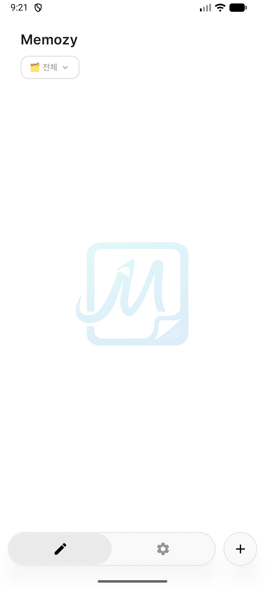
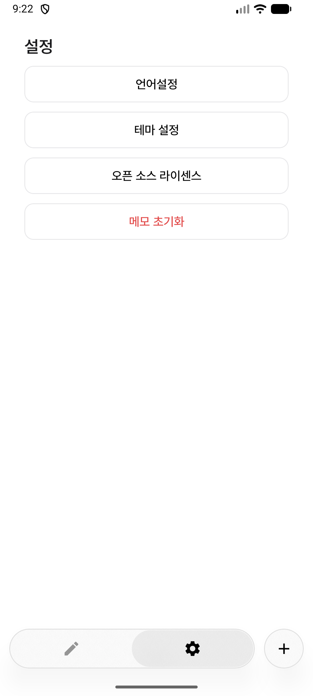
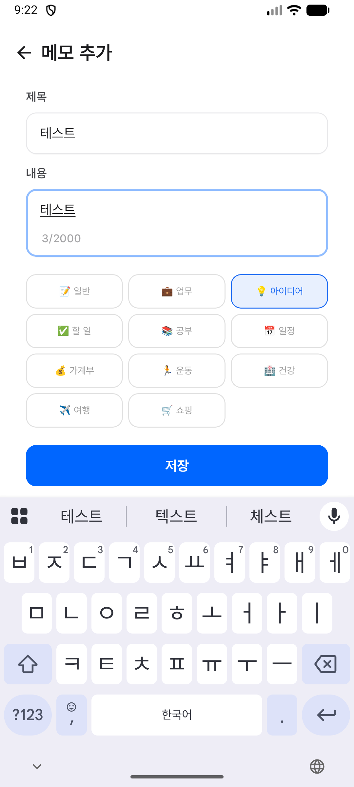
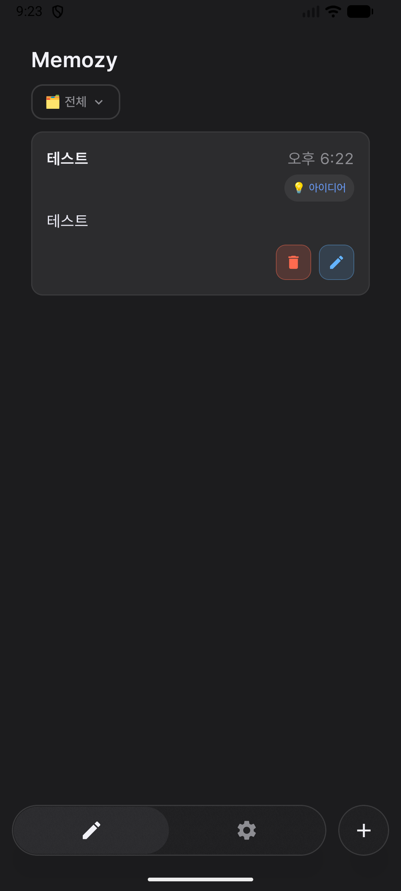
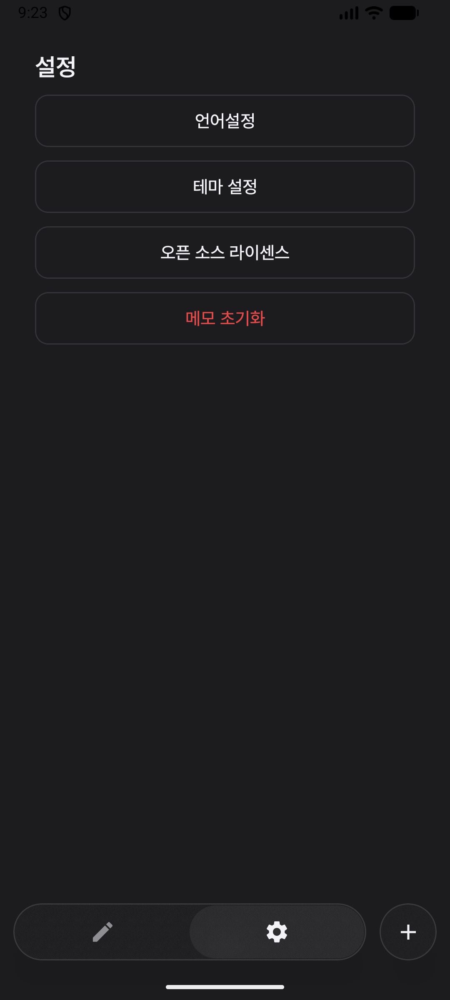
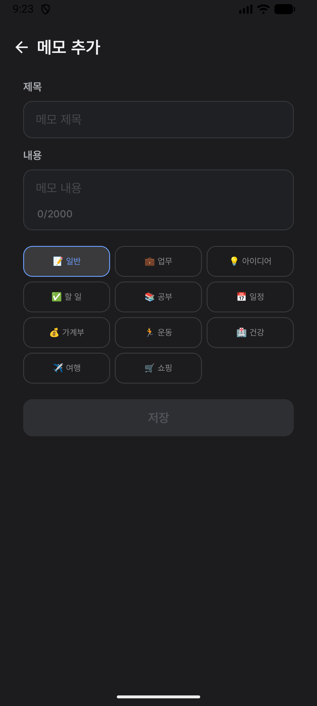

<div align="center">


# 📝 Memozy

**심플하고 빠른 메모 앱**
카테고리 분류 · 다크모드 · 다국어 지원

</div>

---

## ✨ Features

| 기능 | 설명 |
|------|------|
| 📂 카테고리 | 11가지 카테고리로 메모 분류 (일반, 업무, 아이디어 등) |
| 🌙 테마 | 라이트 / 다크 / 시스템 모드 지원 |
| 🌐 다국어 | 한국어 · English · 日本語 |
| ✏️ 메모 | 제목 + 내용 작성, 생성/수정 시간 표시 |
| 🗂️ 필터 | 카테고리별 필터링 |
| 🔍 검색 | 제목/내용 실시간 검색 *(개발 예정)* |

---

## 🛠 Tech Stack

**Language & UI**


**Architecture**


**기타**


---

## 📐 Architecture

```
app/
├── di/                    # Hilt DI 모듈
├── Memo.kt                # Entity
├── MemoDao.kt             # Room DAO
├── MemoRepository.kt      # Repository 인터페이스
├── MemoRepositoryImpl.kt  # Repository 구현체
├── MainViewModel.kt       # ViewModel
├── HomeScreen.kt          # 홈 화면
├── MemoScreen.kt          # 메모 작성/편집 화면
└── SettingsScreen.kt      # 설정 화면
```

> MVVM + Repository Pattern · Room DB (Migration 지원) · Hilt DI

---

## 🚀 Getting Started

### 요구사항
- Android Studio Ladybug 이상
- Android 8.0 (API 26) 이상

### 빌드
```bash
git clone https://github.com/pecos-lab/memozy.git
cd memozy
./gradlew assembleDebug
```

---

## 📱 Screenshots

### ☀️ Light Mode

<div align="center">



</div>

### 🌙 Dark Mode

<div align="center">



</div>

---

## 🗺 Roadmap

- [ ] 검색 기능
- [ ] 정렬 기능 (최신순 / 오래된순)
- [ ] 메모 복사 / 공유
- [ ] 마크다운 지원

---

## 📄 License

```
Copyright 2026 pecos-lab

Licensed under the Apache License, Version 2.0
```

---

<div align="center">

Made by [pecos-lab](https://github.com/pecos-lab)

</div>
